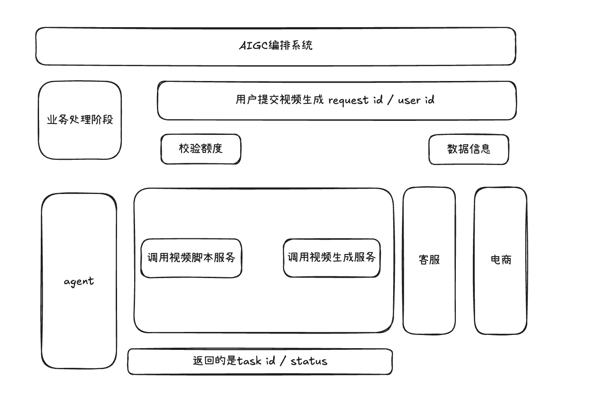

# aigc-workflow (MVP)

最小可运行的 AIGC 任务编排系统（本地模拟版），只保留题目要求的核心闭环：

- 多用户并发提交
- 配额不足立即拒绝
- 脚本生成（默认 5 秒）
- 视频生成（默认 30 秒）
- 最终结果返回（`oss://content/<taskId>.mp4`）

不包含：商品查询、库存查询、图片生成、配音字幕、ReAct、多模态、缓存等。

## 结构

```text
aigc-workflow/
├── main.py
├── models/task.py
├── agents/
│   ├── script_agent.py
│   └── video_agent.py
├── services/
│   ├── account_service.py
│   └── workflow_engine.py
├── repository/task_repository.py
├── workers/workers.py
└── tests/test_mvp.py
```

## 运行

```bash
cd ~/Desktop/content/aigc-workflow
python3 main.py
```

## Agent CLI 调用方式（规划）

目标：把本项目作为一个“Agent 的 CLI 工具”来调用，统一用子命令表达常见动作：

```bash
cd ~/Desktop/content/aigc-workflow
python3 main.py <plan|submit|watch|serve|scenario> ...
```

说明：当前代码实现仍以 `scenario`（跑批/压测）为主；其余子命令在 README 里提供“对外接口与行为契约”的规划，便于后续实现时不再做决策。

### 1) `plan`（不执行、不扣配额）

输出一次任务的编排计划（见下方 `WorkflowPlan` JSON），用于评审/演示，不会创建任务、不会扣配额。

```bash
python3 main.py plan --user-id U001 --prompt "帮我生成一个展示红色连衣裙的短视频" --script-sec 5 --video-sec 30 --max-retry 2
```

预期输出：一段 `WorkflowPlan` JSON（stdout）。

### 2) `submit`（提交任务、扣配额）

规划两种模式（默认推荐走 API）：

- `--api http://127.0.0.1:8000`：通过 HTTP API 提交任务，返回 `taskId`
- `--local`：本地 in-process 提交并执行（适合 demo，进程退出会丢状态）

```bash
python3 main.py submit --api http://127.0.0.1:8000 --user-id U001 --prompt "帮我生成一个展示红色连衣裙的短视频"
```

预期输出：

```json
{ "taskId": "T...", "status": "PENDING" }
```

### 3) `watch`（订阅进度直到完成）

订阅任务进度（优先 SSE，不可用则轮询），直到 `final=true`。

```bash
python3 main.py watch --api http://127.0.0.1:8000 --task-id Txxxxxxxx
```

预期输出：持续打印事件，最终一条包含 `final=true`，成功则含 `videoUrl`，失败则含 `errorMessage`。

### 4) `serve`（对外 API server）

启动 FastAPI + 后台 worker，对外提供任务提交、状态查询、SSE 事件流。

```bash
python3 main.py serve --host 127.0.0.1 --port 8000 --workers 3 --script-sec 5 --video-sec 30 --max-retry 2
```

预期输出：服务启动日志，并监听 `http://127.0.0.1:8000`。

### 5) `scenario`（保留现有压测/矩阵）

用于压测/演示：控制用户数、失败率、配额不足比例、耗时等。

```bash
python3 main.py scenario --matrix-users 5,10 --fail-mode mixed --fail-ratio 0.4 --quota-shortage-ratio 0.3 --script-sec 0.2 --video-sec 0.4
```

预期输出：case/summary/task/retry 等日志（用于演示系统行为）。

## “规划结果”结构化方案（WorkflowPlan JSON）

`plan` 子命令建议输出如下 JSON，字段固定，避免后续实现时再做决策：

```json
{
  "workflow": "aigc-video-mvp@v1",
  "input": { "userId": "U001", "prompt": "帮我生成一个展示红色连衣裙的短视频" },
  "steps": [
    {
      "name": "SCRIPTING",
      "expectedSec": 5,
      "timeoutSec": 8,
      "retry": { "maxRetry": 2, "backoff": "exponential" },
      "progress": 30
    },
    {
      "name": "RENDERING",
      "expectedSec": 30,
      "timeoutSec": 35,
      "retry": { "maxRetry": 2, "backoff": "exponential" },
      "progress": 70
    },
    { "name": "DONE", "progress": 100 }
  ],
  "outputs": { "videoUrlTemplate": "oss://content/{taskId}.mp4" },
  "notes": "plan only: do not execute, do not consume quota"
}
```

## 对外 HTTP API 规划（FastAPI）

### 1) `POST /v1/tasks`

Request body：

```json
{
  "userId": "U001",
  "prompt": "帮我生成一个展示红色连衣裙的短视频",
  "params": { "scriptSec": 5, "videoSec": 30, "maxRetry": 2 }
}
```

Response：

```json
{ "taskId": "T...", "status": "PENDING" }
```

配额不足（固定为 409）：

```json
{ "code": "QUOTA_NOT_ENOUGH", "message": "user=U001 quota not enough, remain=0, required=1" }
```

### 2) `GET /v1/tasks/{taskId}`

Response（字段固定）：`script/videoUrl/errorMessage` 为可选。

```json
{
  "taskId": "T...",
  "requestId": "req-...",
  "userId": "U001",
  "status": "RENDERING",
  "progress": 70,
  "script": "Script for ...",
  "videoUrl": "oss://content/T....mp4",
  "errorMessage": null,
  "retryCount": { "SCRIPT": 1, "VIDEO": 0 },
  "createdAt": "2026-05-27T00:00:00Z",
  "updatedAt": "2026-05-27T00:00:10Z"
}
```

### 3) `GET /v1/tasks/{taskId}/events`（SSE）

响应头：`Content-Type: text/event-stream`

事件示例：

```text
data: {"step":"SCRIPTING","progress":30,"status":"SCRIPTING","message":"...","time":"...","final":false}
data: {"step":"RENDERING","progress":70,"status":"RENDERING","message":"...","time":"...","final":false}
data: {"step":"DONE","progress":100,"status":"SUCCESS","message":"...","time":"...","final":true,"videoUrl":"oss://content/T....mp4"}
```

## v2: MCP tools mapping（可选）

若后续需要以 MCP 对外提供，可按以下映射规划 tool：

- `submit_video_task(userId, prompt, params) -> {taskId, status}`
- `get_task(taskId) -> Task`
- `stream_task_events(taskId) -> event stream`

## 当前已实现的 CLI（现状）

当前 `main.py --users/--matrix-users/...` 的跑批模式属于 `scenario` 类需求，后续可迁移到子命令 `scenario` 下。

## 场景参数（现状实现）

- `--users`: 用户数
- `--matrix-users`: 多组用户数（如 `5,10,50`）
- `--quota-shortage-ratio`: 配额不足比例
- `--fail-mode`: `none|script|video|mixed`
- `--fail-ratio`: 失败注入比例
- `--script-sec` / `--video-sec`: 步骤耗时
- `--workers`: worker 数量
- `--max-retry`: 重试次数
- `--sse`: 输出进度流

## 常用演示命令




```bash
cd ~/Desktop/content/aigc-workflow

# 单场景（3用户，无失败，快速演示）
python3 main.py --users 3 --script-sec 0.2 --video-sec 0.4

# 多场景矩阵（5和10用户，混合失败 + 配额不足）
python3 main.py --matrix-users 5,10 --fail-mode mixed --fail-ratio 0.4 --quota-shortage-ratio 0.3 --script-sec 0.2 --video-sec 0.4

# 打开 SSE 进度流日志（会输出每个 task 的进度事件）
python3 main.py --users 5 --sse --script-sec 0.2 --video-sec 0.4
```

## 测试

先进入项目目录：

```bash
cd ~/Desktop/content/aigc-workflow
```

运行全部测试：

```bash
python3 -m unittest discover -s tests -p 'test_*.py' -v
```
